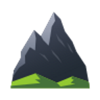

<h1>
  
  Pirin UI
</h1>

**Pirin UI** е потребителски интерфейс за уеб приложението **Пирин Сървър**, разработен с Nuxt 4, Vue 3 и Vuetify 3. Демонстрация на приложението е достъпна [тук](https://pirin-ui-nuxt4.pages.dev/).

### Достъп до демонстрацията

За да влезете в демонстрацията, използвайте следните идентификационни данни:

- **Email:** `martinvarev@skyware-group.com`
- **Password:** `Martin123*`

## Информация за продукта

**Пирин Сървър** е софтуерен продукт за публикуване на лабораторни резултати от ЛИС iLab в НЗИС. Той може да бъде разгърнат на различни платформи, включително:

- Приложение на Internet Information Server (IIS)
- Конзолно приложение или услуга (Windows Service) на Windows
- Конзолно приложение или услуга (daemon) на GNU/Linux
- Docker контейнер
- Облачно приложение в Microsoft Azure или други облачни услуги

### Зависимости

За да работи **Пирин Сървър**, е необходимо:

- **Microsoft SQL Server** – база данни за ЛИС iLab
- **Рила сървър** – за е-подписване и връзка с НЗИС
- **Гарван сървър** – услуга за прекодиране между НЗОК, LOINC и НЗИС кодиране
- **Microsoft .NET Core 6.0** – инсталиран на машината
- **Достъп до интернет** – за нормална работа на сървъра
- Препоръчва се използването на защитни услуги като **CloudFlare**

## Авторски права

Този софтуер е защитен с авторски права, носител на които е **СКАЙУЕР Груп ЕООД**. Неразрешената употреба е престъпление, което се преследва от българските и международни закони.  
**Copyright © 2022 by SKYWARE Group EOOD**

## Приноси

**Пирин Сървър** използва различни интелектуални активи на трети страни, изброени по-долу:

- **Разработчици на Пирин**: Михаил Калъчев, Иван Калъчев
- **Microsoft**: .NET Framework Core, Entity Framework Core, ASP.NET Core, Application Insights
- **AutoMapper**: Lucian Bargaoanu, Jimmy Bogard и др.
- **NLog**: Julian Verdurmen, Jarek Kowalski, Rolf Kristensen и др.
- **Polly**: Dylan Reisenberger, Joel Hulen и др.
- **Swashbuckle**: Richard Morris, Martin Costello и др.
- **VueJS**: Evan You, Ben Hong и др.
- **Vuetify**: John Leider, Heather Leider и др.
- **Axios**: Matt Zabriskie, Nick Uraltsev и др.
- **Material Design Icons**: Austin Andrews и др.

## Лиценз и използване

Всеки потребител трябва да уреди правата си за ползване на този софтуер с автора. За повече информация се свържете със **СКАЙУЕР Груп ЕООД**.

## Демонстрация

Приложението е разгърнато и достъпно на [Cloudflare Pages](https://pirin-ui-nuxt4.pages.dev/).

### Версия

**Пирин 2.0.0-alpha.1+e395c3ed56c264154c7a5cf4189123f68445b0dc**
